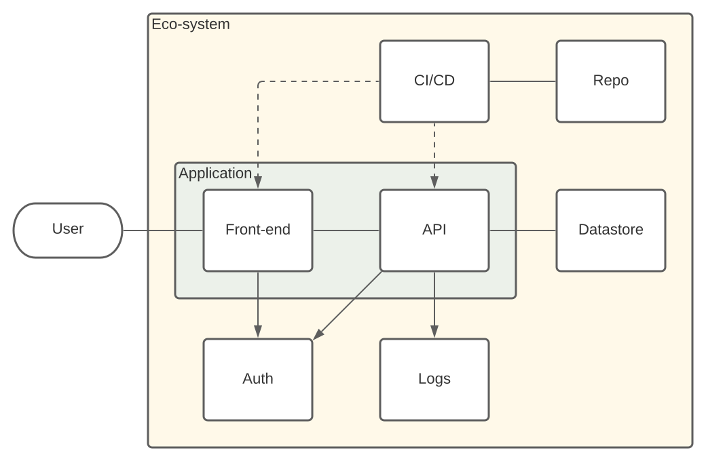

# Documentation

## Overview (Planned)

## Priority List

- Merge existing main/release branches into new release (reset of project).
- (Using a scratch project) test the elements of the proposed eco-system.
    - Improved Java/image build.
    - Production-grade repo (containerized).
    - Production-grade CI/CD (containerized).
    - Production-grade data store (containerized).
    - Ensure application configuration separate from code/Git.
    - Clearer separation of front-end and API.
    - Production-grade authentication server (containerized).
    - Separate logging and monitoring (ELK?).

## Status/Progress

- TODO

